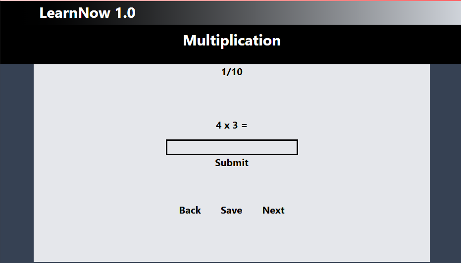
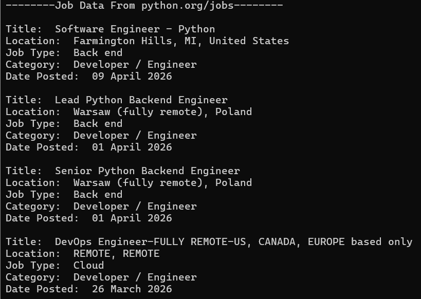
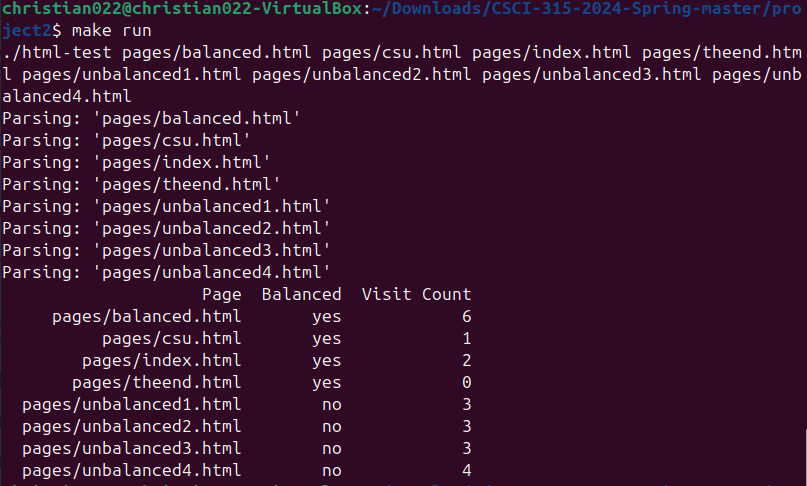
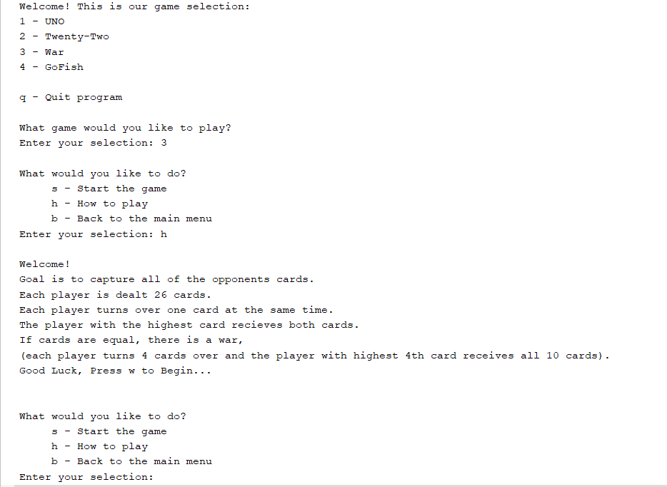
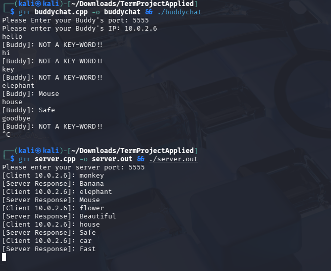

Programming Projects
--------------------

*For access to my private project repositories, please [email me](mailto:clgreen@student.csuniv.edu?subject=GitHub%20Access) with the subject line, GitHub Access.
---
### [LearnNow | CSCI 499](project0)

---
### [Web Scraper | CSCI 301](project1)

---
### [Web Crawler | CSCI 315](project2)

---
### [Game Collection | CSCI 325](project3)

---
### [Buddy Chat | CSCI 332](project4)

---

Ethics Papers
-------------

### [Ethics In Computer Science](pdf/CSCI 315 Ethics Paper.pdf)

-   **Class: Data Structure Analysis**  
-   **Grade: A**

### [Privacy and Anonymity](pdf/CSCI 415 Ethics Paper.pdf)

-   **Class: Algorithms** 
-   **Grade: A**

### [Network Pen Testing Ethics](pdf/CSCI 452 Ethics Paper.pdf)

-   **Class: Network Pen Testing** 
-   **Grade: B**

---

Presentations
-------------

### [Instruction Memory MIPS32 SCP](pdf/mips32-instruction-memory.pdf)

- **Class: Computer Architecture** 
- **Grade: A**

### [Memory Paging Intel 32-bit](pdf/OS Paging Presentation.pdf)

- **Class: Operating Systems** 
- **Grade: A**

---

Page template forked from <a href="https://github.com/csu-cs/csci-portfolio">CSU-CS</a>

<!-- Remove above link if you don't want to attributive -->
