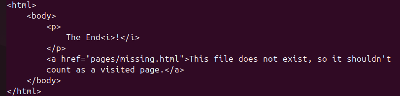
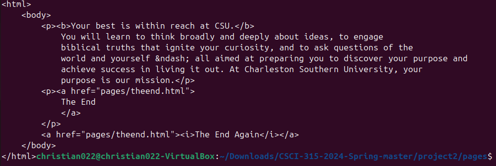
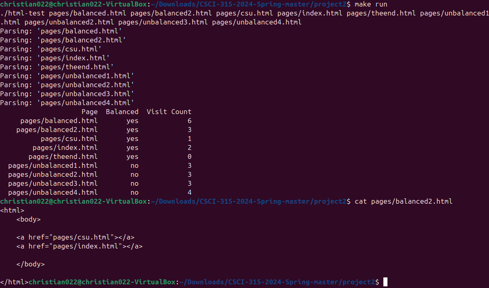

[Back to Portfolio](./)

Web Crawler
===============

-   **Class: Data Structure Analysis** 
-   **Grade: A** 
-   **Language(s): C++** 
-   **Source Code Repository:** [features/mastering-markdown](https://github.com/cchristian01/CSCI-315-2024-Spring/tree/master/project2)  
    (Please [email me](mailto:clgreen@student.csuniv.edu?subject=GitHub%20Access) to request access.)

## Project description

This program parses html files in the pages folder to determine if the tags are balanced or not and also to find the number of unique pages that can be visited from each page. The links to other pages within the <a> tags are counted once for each html file and if an html file has a link to a page that is not in the folder it is counted as 0. The program parses the html files and then displays yes or no for each html file depending on if it had balanced tags and a visit count which is the number of unique links it contained.

## How to compile and run the program

How to compile and run the project.

```bash
make run
```


## UI Design

The program displays each page that it parsed, whether or not that page was balanced and the number of unique pages that could be visited from each html page

  
Fig 1. html file that was parsed 

  
Fig 2. html file that was parsed

  
Fig 3. An additional run with a 2nd balanced html file

## 3. Additional Considerations

The program was run using a makefile on Ubuntu Linux OS 

For more details see [GitHub Flavored Markdown](https://guides.github.com/features/mastering-markdown/).

[Back to Portfolio](./)
