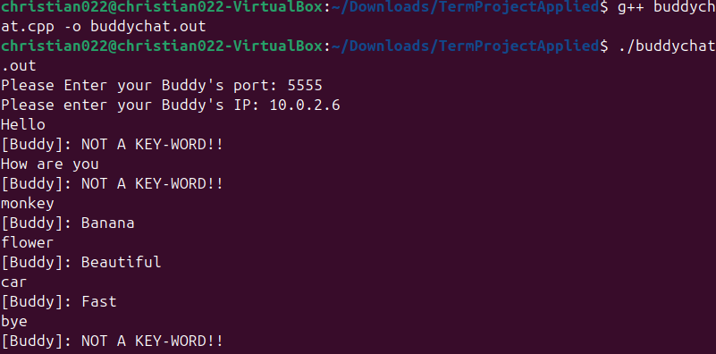

[Back to Portfolio](./)

Buddy Chat
===============

-   **Class: Applied Networking** 
-   **Grade: A** 
-   **Language(s): C++** 
-   **Source Code Repository:** [features/mastering-markdown](https://guides.github.com/features/mastering-markdown/)  
    (Please [email me](mailto:clgreen@student.csuniv.edu?subject=GitHub%20Access) to request access.)

## Project description


The program can be run on two separate terminals in the same host or on two different hosts to demonstrate. One user runs the server version by running and compiling server.cpp file and the other runs the buddy chat with buddychat.cpp. The program is designed for the server to listen to requests from the client and the client connects by entering server's port number when buddy chat is run. Buddychat asks the user to enter both the port and ip of the server. The server responds to the client with Not a Key Word unless the user sends a key word to the server. If a keyword is sent the server sends a response back to client based on the keyword. The server is the buddy of the user running the buddychat program.

## How to compile and run the program

How to compile and run the project.

```bash
g++ server.cpp -o server.out && ./server.out
g++ buddychat.cpp -o buddychat.out && ./buddychat.out
```


## UI Design

When the server is run, the user will have to enter the port number they want the server to run on. The server will need to be running to receive messages from the user running buddychat. When buddychat is run, the user will first have to enter their buddy's ip and port number and then they can send messages and see the server's response. Unless a keyword is sent the server's response will be 'not a key word.' 

  
Fig 1. The launch screen

  
Fig 2. Example output after input is processed.

  
Fig 3. Feedback when an error occurs.

## 3. Additional Considerations

The program can be run in two separate terminals on the same host one for the buddychat and one for the server or on two separate hosts on the same network.
Key words for the user to send to see the buddy's (server's) response are monkey, elephant, flower, house, and car.
For more details see [GitHub Flavored Markdown](https://guides.github.com/features/mastering-markdown/).

[Back to Portfolio](./)
