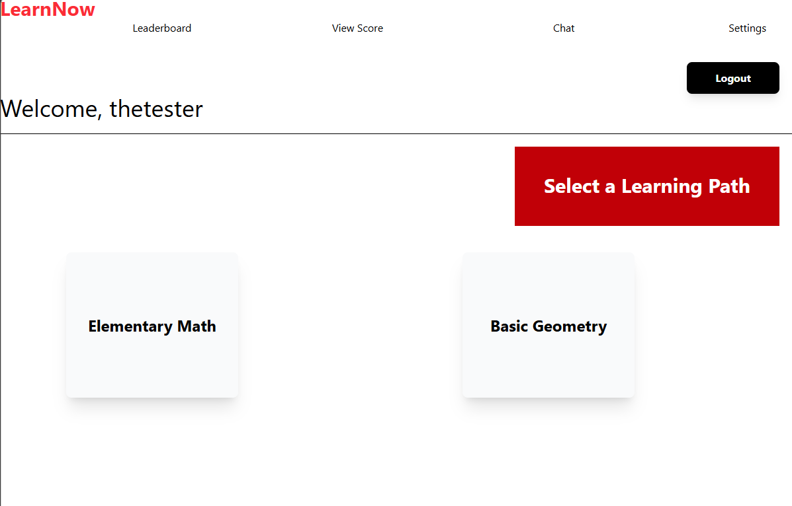
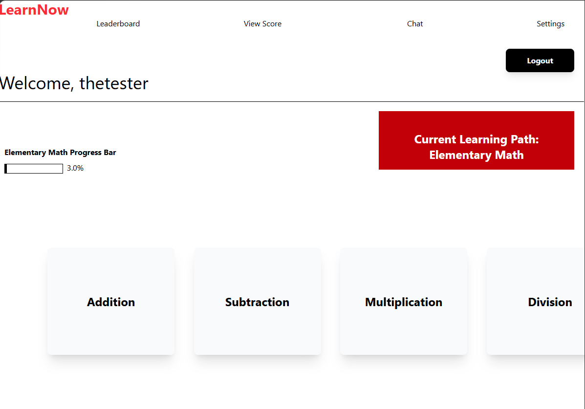
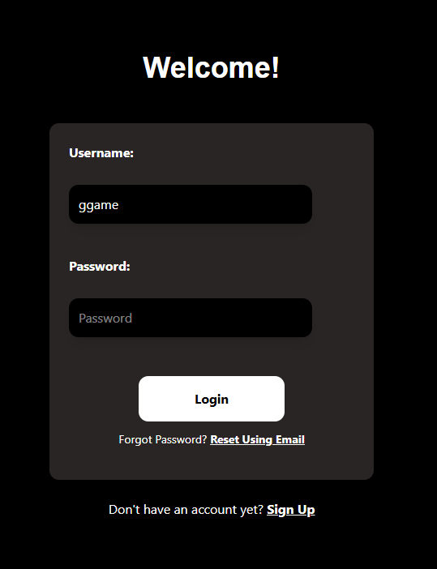
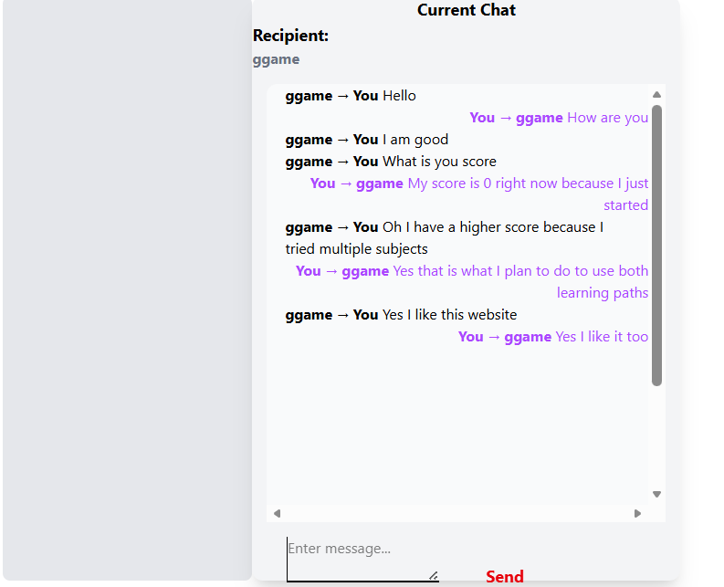

[Back to Portfolio](./)

LearnNow Interactive Learning Webpage
===============
-   **Class: Senior Project Implementation & Defense** 
-   **Grade: To be determined** 
-   **Language(s): Javascript NodeJS MySQL TailwindCSS React C#** 
-   **Source Code Repository:** [features/mastering-markdown](https://github.com/cchristian01/senior-project/tree/master)  
    (Please [email me](mailto:clgreen@student.csuniv.edu?subject=GitHub%20Access) to request access.)

## Project description

This project is a learning website designed to be fun and interactive. The website currently has learning practice for kids in elementary school. The user has to create an account which is stored in the database. The user has the ability to reset their password using their email if they forget it. This allows the user's progress to be displayed on the screen. Their progress updates immediately for both their learning path and subject by submitting it to the database and retrieving it instantly. This happens via the api that sends and receives requests from the server on the backend. The website currently has learning paths for elementary math and basic geometry. The website allows two user to communicate via the chat by searching and selecting the username of the other person if both users are online in the chat. The website has a game implemented for entertainment and to practice knowledged learned in school and on the webpage. The user can also change the theme from light mode to dark mode and view their score as well as the scores of the top 5 users on the leaderboard.

## How to compile and run the program

The project runs in a node js run time set up using react library with vite

## UI Design

The website has a homepage the shows screenshots of the website after the user logs in. The website contains links to the login page and the sign up page. Once the user has signed up and logged in, they will be able to access the page that allows the user to select a learning path. The user then selects a subject and then has the option to click game mode or non game mode. At the top of these pages are links to the leaderboard, the user's score, the chat, and the settings. These pages also display user progress, the user's username, and a logout button. The user can play the game or they can read the course lesson and answer questions. The settings has a feature that allows the user to change the background color of the webpage from light to dark.

  
Fig 1. User sends messages with buddychat and buddy responds

  
Fig 2. Server logs client's message and its response

  
Fig 3. Two separate Linux VMs running server and buddychat to communicate

 
Fig 4. Two separate Linux VMs running server and buddychat to communicate

[Back to Portfolio](./)
